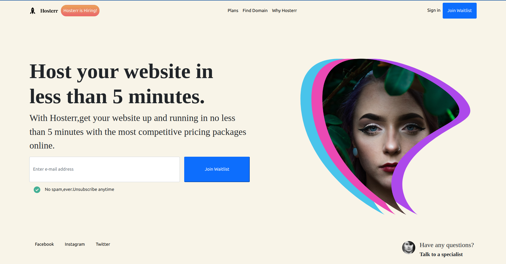

# Hosterr 👋

#### By Catherine Kimani

#### Home Page

## Table of Content

+ [Description](#description)
+ [Live Link](#live-link)
+ [Installation Requirement](#Installation)
+ [Technology Used](#technology-used)
+ [Licence](#licence)
+ [Authors Info](#author-Info)

# Description
A simple React Webpage

## Live Link

## Installation

### Requirements

* Make sure you have access to a browser

* Make Sure you have access to internet

### Installation Process

[Go Back to the top](#hosterr-👋)

## Technology Used
* HTML - which was used to build the structure of the pages.

* CSS - which was used to style the pages incuding the left aside navigation bar

* JavaScript 

* React

## Licence

MIT License

Copyright (c) [2022] [MIT License](LICENCE)

[Go Back to the top](#hosterr-👋)

## Authors Info

Linked - [Catherine Kimani](https://www.linkedin.com/incatherine-kimani/)

[Go Back to the top](#hosterr-👋)